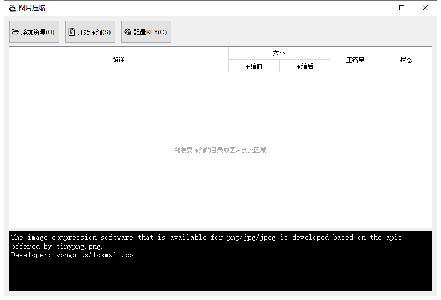
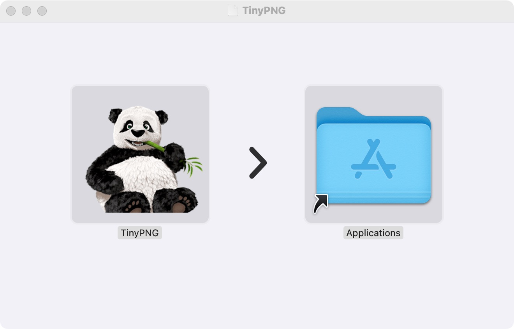
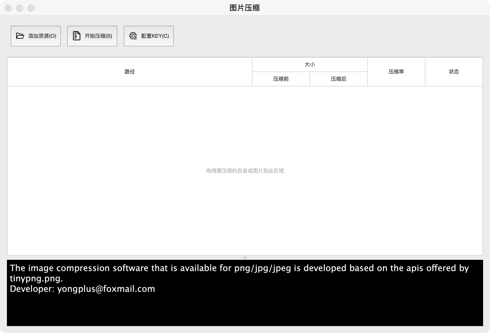

# 图片压缩软件
基于TinyPNG Api压缩软件，可安装直接运行，无需依赖任何第三方包及库。

日常开发经常会用到[tinypng.org](https://tinypng.org/)图片批量压缩，TinyPNG平均压缩率能达到60%，肉眼能观察到的画质损失微乎其微，对页面加载提速及体验、节省用户流量、缩小程序包有很大帮助。

##### 下载：
[Download the installer for Windows>>](https://github.com/yongplus/tinypng/releases/tag/1.0.1)  
[Download the installer for MacOS>>](https://github.com/yongplus/tinypng/releases/tag/1.0.1)

### Screenshots
 
  

  

##### MacOS版  

### 配置
~~TinyPNG Key是免费的，为了安装后可以直接用，软件源码中已有2个Key，安装后会随机配置一个作为使用。每个Key每月免费压缩为500次，若不够可以自己多申请几个（申请很简单，填写邮箱和昵称，便会收到邮件，根据邮件中的链接进入创建key即可）；~~  
由于TinyPNG服务器在国外，国内访问较慢，如果你有国外代理可配置为其加速。  
**2021/08/11 新增免key模式，现在可以无需申请key。（原有的KEY模式同时保留）**

### Usage
 There are two ways to add files:

 1.Click the button at the top-left to choose one or more files or a folder;  
 2.For a more convenient and efficient option, it is recommended to drag and drop the objects directly into the table area of the window;  
 3.Use shortcut keys associated with the buttons, for example: press Ctrl+O to add an object, Ctrl+S to start a task;  
 4.Double-click any row in the table to preview the picture associated with that row in the system's image previewer;    
 5.You can delete rows either by right-clicking on any of them or by selecting the rows and pressing the Del key;    
  
 
 Remark: If the object you add is a folder, the software will automatically list all the image files contained within that folder recursively.

### Comparisons
以下是对电商项目的商品详情页图片压缩测试数据，无论是页面大小还是访问速度的提升都很显著  
  

##### 免责声明
该仓库仅用于学习，如有商业用途，请购买官方的 pro 版：https://tinify.com/checkout/web-pro

This Repo is only for study.

