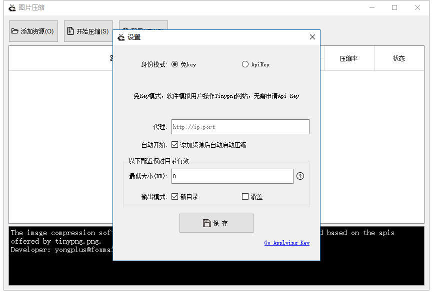

# 图片压缩软件
基于TinyPNG Api压缩软件，可安装直接运行，无需依赖任何第三方包及库。

[Download the installer for Windows>>](https://dd.0f3.com/tinypng/installer.exe)
[Download the installer for MacOS>>](https://dd.0f3.com/tinypng/Tinypng-MacOS.zip)

日常开发经常会用到[tinypng.org](https://tinypng.org/)图片批量压缩，TinyPNG平均压缩率能达到60%，肉眼能观察到的画质损失微乎其微，对页面加载提速及体验、节省用户流量、缩小程序包有很大帮助。

项目图片过多时，通过官方网站压缩效率低、繁琐，于是最初用Go基于TinyPNG API写了个CLI程序，操作不是太方便，凭借对窗体软件的热爱和本着学习心态决定用C++写个GUI程序。

### Screenshots： 
  
  

### 配置
TinyPNG Key是免费的，为了安装后可以直接用，软件源码中已有2个Key，安装后会随机配置一个作为使用。每个Key每月免费压缩为500次，若不够可以自己多申请几个（申请很简单，填写邮箱和昵称，便会收到邮件，根据邮件中的链接进入创建key即可）；   
由于TinyPNG服务器在国外，国内访问较慢，如果你有国外代理可配置为其加速。  
**2021/08/11 新增免key模式，现在可以无需申请key；**

### Usage:
 There are two ways to add the files:  
 1.Clicking the button on the top-left choose one or more files or a folder.   
 2.Recommended way,For more convenient and efficient, The software supports the object can be dragged directly into the area of table in the window.   
 3.You can push the button by a shortcut key associated with the button, For example :press Ctrl+O to add object, Ctrl+S to start task.   
 4.Double-Clicking the any row in the table the picture associated with row will preview in system image previewer.  
 5.Either right-Clicking on the any rows or selecting rows and pressing key Del delete the rows.  

 Remark: If the object you gave is a folder,the sofeware will list automatically all the image files in that folder.

### Comparisons:
以下是对电商项目的商品详情页图片压缩测试数据，无论是页面大小还是访问速度的提升都很显著  
  

